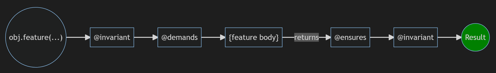
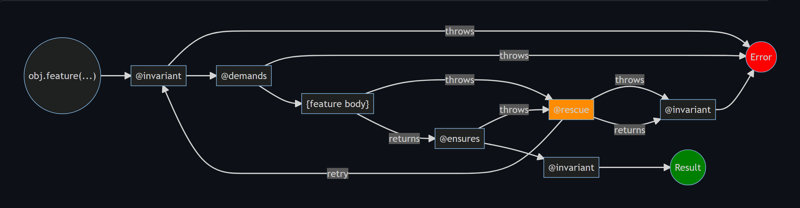

# Decorator Contracts

[](https://github.com/final-hill/decorator-contracts/actions?query=workflow%3ABuild%2FRelease)
[](https://www.npmjs.com/package/@final-hill/decorator-contracts)
[](https://www.npmjs.com/package/@final-hill/decorator-contracts)

## Table of Contents

- [Introduction](#introduction)
- [Library Installation](#library-installation)
- [Usage](#usage)
- [Checked Mode](#checked-mode)
- [Assertions](#assertions)
- [Implies](#implies)
- [Iff](#iff)
- [Encapsulation](#encapsulation)
- [Invariants](#invariants)
- [Demands](#demands)
- [Ensures](#ensures)
- [Rescue](#rescue)
- [The order of assertions](#the-order-of-assertions)
- [Further Reading](#further-reading)

## Introduction

Decorator Contracts is a library that provides the ability to create and assign
Code Contracts to ECMAScript and TypeScript classes. This enables
enforcement of the
[Liskov substitution principle](https://en.wikipedia.org/wiki/Liskov_substitution_principle)
of [SOLID](https://en.wikipedia.org/wiki/SOLID)
and [Organized Panic](https://en.wikipedia.org/wiki/Exception_handling#Exception_handling_based_on_design_by_contract) to support
[Design By Contract™](https://en.wikipedia.org/wiki/Design_by_contract).

Note that the license for this library is [AGPL-3.0-only](https://www.gnu.org/licenses/agpl-3.0.en.html).
You should [know what that means](https://choosealicense.com/licenses/agpl-3.0/) before
using this. If you would like an exception to this license per section 7
[contact the author](mailto:michael.haufe@final-hill.com).

## Library Installation

The latest version:

`npm install @final-hill/decorator-contracts`

A specific version:

`npm install @final-hill/decorator-contracts@x.x.x`

For use in a browser (no build step) via [unpkg.com](https://unpkg.com/):

```html
<script type="importmap">
{
    "imports": {
        "@final-hill/decorator-contracts": "https://unpkg.com/@final-hill/decorator-contracts"
    }
}
</script>
```

Via [skypack.dev](https://www.skypack.dev/):

`<script type="module" src="https://cdn.skypack.dev/@final-hill/decorator-contracts"></script>`

## Usage

After installation, use the decorators directly on your class methods and properties. All contracted classes must extend `Contracted` and be instantiated using the static `.new()` method.

```typescript
import { Contracted, invariant, demands, ensures } from '@final-hill/decorator-contracts';

@invariant((self: Stack<any>) =>
    self.isEmpty() == (self.size == 0) &&
    self.isFull() == (self.size == self.limit) &&
    self.size >= 0 && self.size <= self.limit
)
class Stack<T> extends Contracted {
    private _implementation: T[] = [];
    private _size = 0;
    private _limit: number;

    constructor(limit: number) {
        super();
        this._limit = limit;
    }

    get limit() { return this._limit; }
    get size() { return this._size; }

    clear(): void {
        this._implementation = [];
        this._size = 0;
    }

    isEmpty(): boolean { return this._implementation.length == 0; }
    isFull(): boolean { return this._implementation.length == this.limit; }

    @demands((self: Stack<any>) => !self.isEmpty())
    @ensures((self: Stack<any>, _args, old: Stack<any>) =>
        !self.isFull() && self.size == old.size - 1)
    pop(): T {
        this._size--;
        return this._implementation.pop()!;
    }

    @demands((self: Stack<any>) => !self.isFull())
    @ensures((self, [item], old: Stack<any>) =>
        !self.isEmpty() &&
        self.top === item &&
        self.size === old.size + 1
    )
    push(item: T): void {
        this._size++;
        this._implementation.push(item);
    }

    get top(): T | undefined {
        return this._implementation.at(-1);
    }
}

const stack = Stack.new(3);
stack.push(1);
stack.push(2);
stack.pop();
```

## Instantiation: Using the Static `.new(...)` Method

Because this library uses JavaScript `Proxy` to enforce contracts, you **must** instantiate all classes that extend `Contracted` using the static `.new(...)` method (not with `new MyClass(...)`).

This is required so that the instance is wrapped in a Proxy and invariants are asserted immediately after construction. Direct use of the `new` keyword will throw an error.

## Checked Mode

Checked Mode controls whether contract checking (invariants, demands, ensures, and rescue) is enabled or disabled at runtime. This feature allows you to turn off contract enforcement in production environments for maximum performance, while keeping it enabled during development and testing to catch bugs and contract violations early.

By default, Checked Mode is enabled. You can control it via the static `[checkedMode]` symbol property of Contracted:

```typescript
Contracted[checkedMode] = false; // Disable Checked Mode
```

One approach to managing this is to leverage environment variables. For example, you can interrogate `NODE_ENV` to determine whether to enable or disable Checked Mode:

```typescript
Contracted[checkedMode] = process.env.NODE_ENV === 'development'
```

## Assertions

Use the `assert` function for inline assertions:

```typescript
import { assert } from '@final-hill/decorator-contracts';

function avg(xs: number[]): number {
    assert(xs.length > 0, 'The list can not be empty');
    return xs.reduce((sum, next) => sum + next) / xs.length;
}
```

If you are using TypeScript, `assert` will also assert the type of the condition:

```typescript
let str: any = 'foo';

str.toUpperCase(); // str is any

assert(typeof str == 'string');

str.toUpperCase(); // str is now a string
```

**`assert` should not be used for validating arguments**

Use the `@demands` decorator for this purpose.

## Implies

When defining predicates it is a common use case to encode [material implication](https://en.wikipedia.org/wiki/Material_conditional):

```typescript
import { implies } from '@final-hill/decorator-contracts';

implies(weather.isSunny, person.visitsBeach);
// Equivalent to: !weather.isSunny || person.visitsBeach
```

## Iff

When defining predicates it is a common use case to encode [if and only if](https://en.wikipedia.org/wiki/Logical_biconditional):

```typescript
import { iff } from '@final-hill/decorator-contracts';

iff(person.hasTicket, person.ridesTrain);
// Equivalent to: implies(p, q) && implies(q, p)
```

## Encapsulation

To guarantee invariants remain valid for classes, public property definitions are forbidden. All interactions with a contracted class must be done through a method or getter/setter. Only properties that start with `_` (conventionally private) can be assigned to after construction.

```typescript
class Example extends Contracted {
    _private = 1; // Allowed
    publicProp = 2; // Not allowed
}
```

## Note on Private Fields and Accessors

Due to the use of JavaScript `Proxy` in the implementation of this library, native `#private` fields and the `accessor` keyword are **not supported**. Instead, use conventional private fields (e.g., `_private`) and define explicit getter/setter pairs for encapsulation:

```typescript
class Example extends Contracted {
    private _value = 0;
    get value() { return this._value; }
    set value(v: number) { this._value = v; }
}
```

Do **not** use:

- `#privateField` syntax
- `accessor foo` syntax

These will not work correctly with the contract enforcement provided by this library.

## Invariants

Use the `@invariant` decorator on your class to enforce relationships between properties and methods. The invariant is checked after construction, before and after every method execution, and before and after every get/set usage.

```typescript
@invariant(self => self.value >= 0)
class Foo extends Contracted {
    protected _value = 0;
    get value() { return this._value; }
    set value(v: number) { this._value = v; }

    inc(): void { this.value++; }
    dec(): void { this.value--; }
}
```

### Subcontracting and Invariants

When subclassing, if a subclass defines its own `@invariant`, the resulting invariant is **strengthened**: the subclass invariant and the base class invariant are both enforced (they are logically AND-ed together). This means all invariants in the inheritance chain must hold for the object to be valid.

```typescript
@invariant(self => self.value >= 0)
class Base extends Contracted {
    // ...
}

@invariant(self => self.value <= 10)
class Sub extends Base {
    // ...
}
// The effective invariant for Sub is: (self.value >= 0) && (self.value <= 10)
```

## Demands

Use the `@demands` decorator to specify preconditions for methods or get/set. If the condition fails, an error is thrown before the method executes.

```typescript
class Foo extends Contracted {
    protected _value = 0;
    get value() { return this._value; }
    set value(v: number) { this._value = v; }

    @demands(self => self.value >= 0)
    dec(): void { this.value--; }
}
```

### Subcontracting and Demands

When subclassing, if a subclass defines its own `@demands` for a method, the resulting precondition is **weakened**: the subclass and base class demands are OR-ed together. The method can be called if **any** of the demands in the inheritance chain are satisfied.

```typescript
class Base extends Contracted {
    @demands((_self, x: number) => x >= 0)
    foo(x: number) { /* ... */ }
}

class Sub extends Base {
    @demands((_self, x: number) => x === 42)
    override foo(x: number) { /* ... */ }
}
// The effective demand for Sub#foo is: (x >= 0) || (x === 42)
```

## Ensures

Use the `@ensures` decorator to specify postconditions for methods or get/set. If the condition fails, an error is thrown after the method executes.

```typescript
class Foo extends Contracted {
    protected _value = 0;
    get value() { return this._value; }
    set value(v: number) { this._value = v; }

    @ensures(self => self.value >= 0)
    dec(): void { this.value--; }
}
```

### Subcontracting and Ensures

When subclassing, if a subclass defines its own `@ensures` for a method, the resulting postcondition is **strengthened**: the subclass and base class ensures are AND-ed together. The method's result must satisfy **all** ensures in the inheritance chain.

```typescript
class Base extends Contracted {
    @ensures((_self, _args, x: number) => x >= 0)
    foo(x: number) { /* ... */ }
}

class Sub extends Base {
    @ensures((_self, _args, x: number) => x <= 10)
    override foo(x: number) { /* ... */ }
}
// The effective ensures for Sub#foo is: (x >= 0) && (x <= 10)
```

## Rescue

Use the `@rescue` decorator to handle exceptions thrown by a method, restore invariants, or retry execution:

```typescript
import { rescue } from '@final-hill/decorator-contracts';

class Example extends Contracted {
    private _value = 3;
    get value() { return this._value; }
    set value(v) { this._value = v; }

    @rescue(self => self.value = 5)
    method1(): void { throw new Error('I am error'); }
}
```

You can also use the `retry` function in your rescue handler to attempt the method again:

```typescript
class Example extends Contracted {
    @rescue((_self, _error, _args, retry) => retry(3))
    method(value: number): number {
        if (value <= 0)
            throw new Error('value must be greater than 0');
        else
            return value;
    }
}
```

### Robustness, Organized Panic, and the Benefits of `@rescue`

The `@rescue` decorator enables a mechanism for **Robustness** in your code. It allows your implementation to respond to situations not specified, providing the ability to handle exceptions in a structured way. This is sometimes called **Organized Panic**.

In addition, `@rescue` provides a foundation for **N-Version programming**, **Fault-Tolerance**, and **Redundancy**. You can implement multiple strategies for handling errors, retrying with alternative logic or data, and ensuring your application can recover from unexpected failures.

Unlike traditional `try/catch`, where exceptions are non-resumable and often handled far from the source (leading to scattered and redundant error handling), `@rescue` allows for **resumable exceptions** and localized, declarative error handling. This means:

- You can lexically determine where exception handling occurs.
- You can restore invariants or perform corrective actions before retrying or failing.
- You can optionally call `retry` to attempt the method again with new arguments or after fixing state, providing a form of fault tolerance and robustness.
- You can implement alternative strategies for error recovery, supporting N-Version programming and redundancy.

**Inheritance:**

If a base class declares a `@rescue` handler for a method, that handler is inherited by subclasses unless the subclass overrides it with its own `@rescue` declaration. This ensures that robust error handling is preserved throughout the inheritance chain, unless explicitly changed.

This approach leads to more maintainable and robust code, as error handling is organized and closely tied to the contract of the class feature, rather than being scattered throughout the call stack.

## The order of assertions

When `obj.feature` is called the happy path is:



If an error is thrown and there is no `@rescue` defined then the `@invariant` is checked before the error is raised to the caller.

If an error is thrown in the `@invariant` then it is raised to the caller.

If an error is thrown in the `@demands` then the error is raised to the caller. In this case the `@invariant` is not checked because the feature body has not been entered and the assertion cannot modify the state of the class without calling another method which is governed by its own contracts.

If an error is thrown by the feature body or the `@ensures` then the `@rescue` is executed. If `retry` is called then the process starts from the beginning.

If `@rescue` throws an error or does not call `retry` then the `@invariant` is checked before the error is raised to the caller.



## Further Reading

- [Design by Contract](https://en.wikipedia.org/wiki/Design_by_contract)
- [Liskov Substitution Principle](https://en.wikipedia.org/wiki/Liskov_substitution_principle)
- [Object-Oriented Software Construction](https://en.wikipedia.org/wiki/Object-Oriented_Software_Construction)
